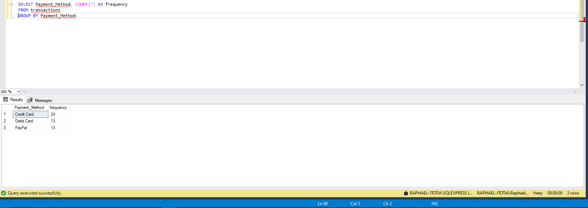

# SQL-in-Action

## Table of contents
- [Dataset Description](#dataset-description)
- [Objective](#objective)
- [Data Setup](#data-setup)
- [SQL Queries](#sql-queries)
- [Data Management](#data-management)
- [Joining Tables](joining-tables)

### Dataset Description: 
 Dataset contains information about online retail sales transactions. It includes the following columns:
  - Transaction_ID: Unique identifier for each transaction.
  - Customer_ID: Unique identifier for each customer.
  - Transaction_Date: Date of the transaction.
  - Product_ID: Unique identifier for each product.
  - Product_Name: Name of the product.
  - Unit_Price: Price per unit of the product.
  - Quantity: Number of units purchased in the transaction.
  - Total_Price: Total price of the transaction.
  - Country: Country where the transaction took place.
  - Payment_Method: Payment method used for the transaction.

You can get a copy of the dataset [here](assets/dataset/Retail_transaction.csv).

### Objective:
I used **Microsoft SQL server** to write and run my SQL queries.

### Data Setup:
1. I created a table alias transactions with the above columns.   
2. Inserted the dataset into the Transactions table.

```sql
/*
1. I created a table alias transactions with the above columns.   
2. Inserted the dataset into the Transactions table.
*/
--1.
   CREATE TABLE transactions(
          Transaction_ID int,
          Customer_ID int,
          Transaction_Date date,
          Product_ID int,
          Product_Name varchar(50),
          Unit_Price float,
          Quantity int,
          Total_Price float,
          Country varchar(50),
          Payment_Method varchar(50));

--2.
  INSERT INTO transactions (Transaction_ID, Customer_ID, Transaction_Date, Product_ID, Product_Name, Unit_Price, Quantity, Total_Price, Country, Payment_Method)VALUES
(1, 101, '2023-01-01', 1, 'Blue T-shirt', 15.99, 2, 31.98, 'USA', 'Credit Card'),
(2, 102, '2023-01-02', 2, 'Black Jeans', 29.99, 1, 29.99, 'UK', 'PayPal'),
(3, 103, '2023-01-03', 3, 'Red Dress', 39.99, 1, 39.99, 'Canada', 'Credit Card'),
(4, 104, '2023-01-04', 4, 'White Sneakers', 24.99, 2, 49.98, 'USA', 'Debit Card'),
(5, 105, '2023-01-05', 5, 'Gray Hoodie', 34.99, 1, 34.99, 'USA', 'Credit Card'),
(6, 106, '2023-01-06', 6, 'Denim Jacket', 49.99, 1, 49.99, 'UK', 'PayPal'),
(7, 107, '2023-01-07', 7, 'Green Skirt', 19.99, 2, 39.98, 'Canada', 'Credit Card'),
(8, 108, '2023-01-08', 8, 'Purple Scarf', 9.99, 3, 29.97, 'USA', 'PayPal'),
(9, 109, '2023-01-09', 9, 'Yellow Sunglasses', 14.99, 1, 14.99, 'UK', 'Debit Card'),
(10, 110, '2023-01-10', 10, 'Orange Backpack', 44.99, 1, 44.99, 'USA', 'Credit Card'),
(11, 111, '2023-01-11', 11, 'Striped Shirt', 19.99, 2, 39.98, 'Canada', 'Debit Card'),
(12, 112, '2023-01-12', 12, 'Polka Dot Dress', 59.99, 1, 59.99, 'UK', 'Credit Card'),
(13, 113, '2023-01-13', 13, 'Plaid Shorts', 24.99, 1, 24.99, 'USA', 'PayPal'),
(14, 114, '2023-01-14', 14, 'Checked Blouse', 29.99, 1, 29.99, 'UK', 'Credit Card'),
(15, 115, '2023-01-15', 15, 'Floral Skirt', 19.99, 2, 39.98, 'Canada', 'Debit Card'),
(16, 116, '2023-01-16', 16, 'Leather Jacket', 79.99, 1, 79.99, 'USA', 'Credit Card'),
(17, 117, '2023-01-17', 17, 'Sweatpants', 34.99, 1, 34.99, 'UK', 'PayPal'),
(18, 118, '2023-01-18', 18, 'Hooded Sweatshirt', 49.99, 1, 49.99, 'Canada', 'Credit Card'),
(19, 119, '2023-01-19', 19, 'Beanie Hat', 12.99, 2, 25.98, 'USA', 'Credit Card'),
(20, 120, '2023-01-20', 20, 'Silk Scarf', 29.99, 1, 29.99, 'UK', 'Debit Card'),
(21, 121, '2023-01-21', 21, 'Cotton Socks', 9.99, 3, 29.97, 'Canada', 'PayPal'),
(22, 122, '2023-01-22', 22, 'Leather Belt', 19.99, 1, 19.99, 'USA', 'Credit Card'),
(23, 123, '2023-01-23', 23, 'Canvas Shoes', 29.99, 1, 29.99, 'UK', 'Debit Card'),
(24, 124, '2023-01-24', 24, 'Printed Tote Bag', 39.99, 1, 39.99, 'Canada', 'Credit Card'),
(25, 125, '2023-01-25', 25, 'Plaid Shirt', 24.99, 2, 49.98, 'USA', 'PayPal'),
(26, 126, '2023-01-26', 26, 'Striped Sweater', 39.99, 1, 39.99, 'UK', 'Debit Card'),
(27, 127, '2023-01-27', 27, 'Denim Shorts', 29.99, 1, 29.99, 'Canada', 'PayPal'),
(28, 128, '2023-01-28', 28, 'Lace Top', 19.99, 2, 39.98, 'USA', 'Credit Card'),
(29, 129, '2023-01-29', 29, 'Knit Beanie', 14.99, 1, 14.99, 'UK', 'Credit Card'),
(30, 130, '2023-01-30', 30, 'Plaid Scarf', 24.99, 1, 24.99, 'Canada', 'Debit Card'),
(31, 101, '2023-01-31', 1, 'Blue T-shirt', 15.99, 2, 31.98, 'USA', 'Credit Card'),
(32, 102, '2023-02-01', 2, 'Black Jeans', 29.99, 1, 29.99, 'UK', 'PayPal'),
(33, 103, '2023-02-02', 3, 'Red Dress', 39.99, 1, 39.99, 'Canada', 'Credit Card'),
(34, 104, '2023-02-03', 4, 'White Sneakers', 24.99, 2, 49.98, 'USA', 'Debit Card'),
(35, 105, '2023-02-04', 5, 'Gray Hoodie', 34.99, 1, 34.99, 'USA', 'Credit Card'),
(36, 106, '2023-02-05', 6, 'Denim Jacket', 49.99, 1, 49.99, 'UK', 'PayPal'),
(37, 107, '2023-02-06', 7, 'Green Skirt', 19.99, 2, 39.98, 'Canada', 'Credit Card'),
(38, 108, '2023-02-07', 8, 'Purple Scarf', 9.99, 3, 29.97, 'USA', 'PayPal'),
(39, 109, '2023-02-08', 9, 'Yellow Sunglasses', NULL, 1, 14.99, 'UK', 'Debit Card'),
(40, 110, '2023-02-09', 10, 'Orange Backpack', 44.99, 1, NULL, 'USA', 'Credit Card'),
(41, 111, '2023-02-10', 11, 'Striped Shirt', 19.99, 2, 39.98, 'Canada', 'Debit Card'),
(42, 112, '2023-02-11', 12, 'Polka Dot Dress', 59.99, 1, 59.99, 'UK', 'Credit Card'),
(43, 113, '2023-02-12', 13, 'Plaid Shorts', 24.99, 1, 24.99, 'USA', 'PayPal'),
(44, 114, '2023-02-13', 14, 'Checked Blouse', 29.99, 1, 29.99, 'UK', 'Credit Card'),
(45, 115, '2023-02-14', 15, 'Floral Skirt', 19.99, 2, 39.98, 'Canada', 'Debit Card'),
(46, 116, '2023-02-15', 16, 'Leather Jacket', 79.99, 1, 79.99, 'USA', 'Credit Card'),
(47, 117, '2023-02-16', 17, 'Sweatpants', 34.99, 1, 34.99, 'UK', 'PayPal'),
(48, 118, '2023-02-17', 18, 'Hooded Sweatshirt', 49.99, 1, 49.99, 'Canada', 'Credit Card'),
(49, 119, '2023-02-18', 19, 'Beanie Hat', 12.99, 2, 25.98, 'USA', 'Credit Card'),
(50, 120, '2023-02-19', 20, 'Silk Scarf', 29.99, 1, 29.99, 'UK', 'Debit Card');
```
#### SQL Output


### SQL Queries:

-	Retrieved the first 10 records from the dataset using the <sup>SELECT</sup> and <sup>LIMIT</sup> functions.
  ```sql
SELECT * FROM transactions
WHERE Transaction_ID<=10
```
#### SQL Output

-	Calculated the total number of transactions in the dataset using the <sup>SELECT</sup> and <sup>COUNT()</sup> functions.
  ```sql
SELECT COUNT(*) AS total_transactions
FROM transactions;
```
#### SQL Output

-	Found the total revenue generated from PayPal using the <sup>SUM()</sup> function.
  ```sql
SELECT SUM(Total_Price) AS total_revenue
FROM transactions
WHERE Payment_Method = 'PayPal'
```
#### SQL Output

-	Identified the top 5 best selling products by quantity sold using the <sup>SELECT</sup>, <sup>ORDER BY</sup>, and <sup>LIMIT</sup> functions.
  ```sql
SELECT TOP 5 Product_Name, SUM(Quantity) AS total_quantity_sold
FROM transactions
GROUP BY Product_Name
ORDER BY total_quantity_sold DESC;
```
#### SQL Output

-	Calculated the average unit price of products sold using the <sup>AVG()</sup> function.
  ```sql
SELECT Product_Name, AVG(Unit_Price) AS avg_unit_price
FROM transactions
GROUP BY Product_Name;
```
#### SQL Output

-	Determined the total sales revenue generated by each country.
  ```sql
SELECT Country, SUM(Total_Price) AS total_revenue
FROM transactions
GROUP BY Country;
```
#### SQL Output

-	Found the total quantity of products purchased by each customer.
  ```sql
SELECT Customer_ID, SUM(Quantity) AS total_products
FROM transactions
GROUP BY Customer_ID;
```
#### SQL Output

-	Identified the most common payment method used for transactions.
  ```sql
SELECT Payment_Method, COUNT(*) AS frequency 
FROM transactions 
GROUP BY Payment_Method;
```
#### SQL Output


### Data Management:

- Created a new table named customer_info with columns for customer details such as '*Customer_ID*', '*Customer_Name*', and '*Email*'.
   ```sql
  CREATE TABLE customer_info(
   Customer_ID int, 
   Customer_Name varchar(60),
   Email varchar(100));
   ```
- Inserted sample customer data into the newly created table.
   ```sql
  INSERT INTO customer_info (Customer_ID,Customer_Name,Email)
  VALUES(101,'Kamau','kam@gmail.com'),(102,'Hellen','Hj1@gmail.com'),(103,'Jacob','jacobng@gmail.com'),(104,'Mukeni','Mukeni@gmail.com');
   ```
#### SQL Output

- Updated the dataset(inserted into Transactions table) to include a new column '*Discount*' and calculate a 10% discount for each transaction.
   ```sql
   ALTER TABLE transactions
   ADD Discount DECIMAL(10, 2);

   UPDATE transactions
   SET Discount = Total_Price * 0.1;
   SELECT * FROM transactions
   ```
#### SQL Output

- Deleted transactions with a quantity of 0 or negative values.
  Used the <sup>DELETE</sup> function for this.
   ```sql
   DELETE FROM transactions
   WHERE Quantity <= 0;
   ```

### Joining Tables:

- Performed inner joins between the original dataset and the 'customer_info' table based on the '*Customer_ID*' column.
```sql
SELECT t.*, c.*
FROM transactions t
INNER JOIN customer_info c ON t.Customer_ID = c.Customer_ID;
```
#### SQL Output

- Wrote a query to retrieve transaction details along with corresponding customer information.
```sql
SELECT t.*, c.Customer_Name, C.Email
FROM transactions t
JOIN customer_info c ON t.Customer_ID = c.Customer_ID;
```
#### SQL Output

### SQL Functions:
 Utilized SQL functions to...


- Extracted the month and year from the '*Transaction_Date*' column.
```sql
SELECT year(Transaction_Date) AS transaction_yr,
       month(Transaction_Date) AS transaction_month
FROM transactions;
```
#### SQL Output


- Concatenated the '*Product_Name*' and '*Country*' columns to create a new column '*Product_Location*'.
```sql
SELECT *,
       CONCAT(Product_Name, ', ', Country) AS Product_Location
FROM transactions;
```
#### SQL Output

